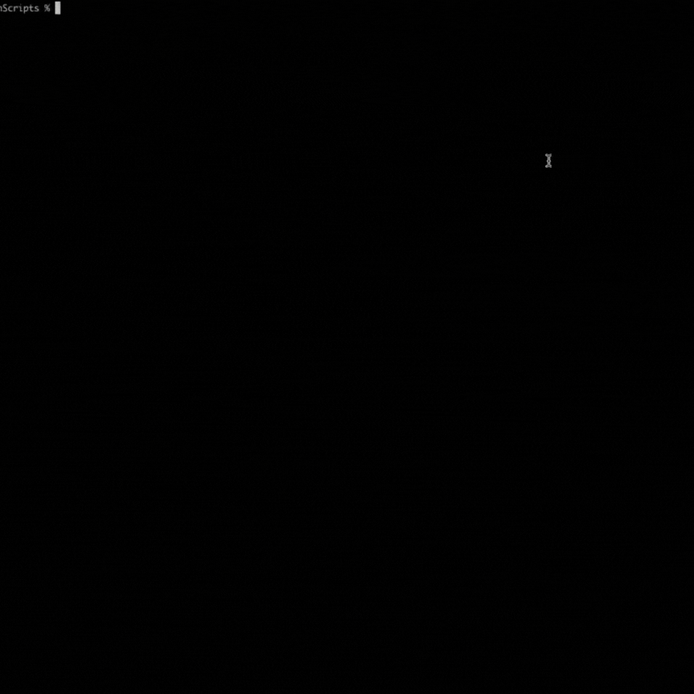
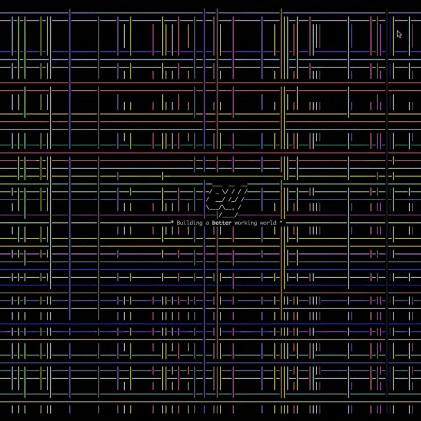

# Ey Terminal Screensaver

EY Screensaver inspired by [pipes.sh](https://github.com/pipeseroni/pipes.sh)

Steps to run:

1. Clone this repo
2. Navigate to the folder this is stored in
3. Type `bash bash.sh`

Or you can just copy and paste the code into your terminal window :)

PRs welcome!

